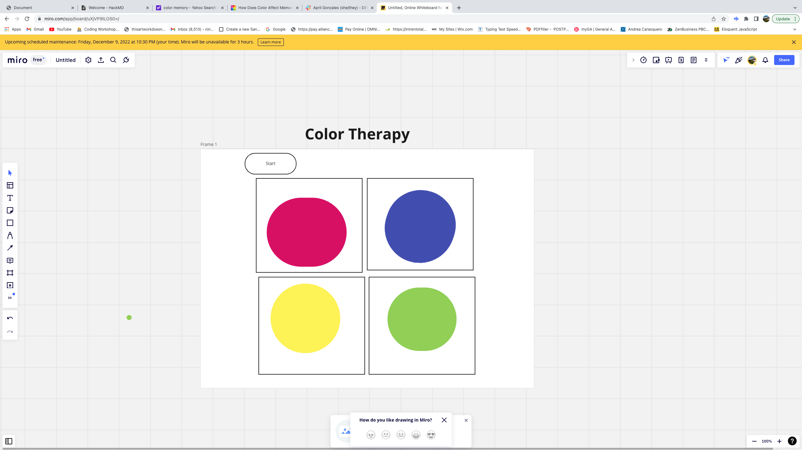

# Color Therapy

A board game that challenges your memory. 

# Game Pitch

Good memory is essential for independent living, staying focused and completing tasks.Research has now proven the link between the use of colors and improving memory. Color therapy uses colors that stimulate the limbic area of the brain, which deals with retention. This game is based on a book called Improving Memory Through Creativity by Amanda Pike, talks of a study on 91 older adults from different countries who were administered art therapy for 10 weeks. At the end of the study, the experimental group reported improved cognitive skills compared to the control group.

# Play the game here:
https://ninambash.github.io/Poject1-COLOR-THERAPY/

# Wireframe

# Tech stack
HTML 
CSS 
JavaScript 
Vanilla DOM 

# MVP Goals
Start button to start playing the game. 
Have 4 boxes in a board. 
Add set Timer function to make colors move from one box to the other. 
Add event listeners for a player to click the colors they saw. 
Start the game with memorising two colors then advancing to more colors as the player keeps getting better. 
Change the H1 to update the player to reflect correct or not correct. 
Add win function to check if the player picked the correct colors. 
Make start button disappear when the player starts playing and re-appear when the round is over. 
Make a function for reset button to restart the game as opposed to reload  

# stretch goals
Adding levels to the game. 
Make colors move faster by decreasing the timer as the player gets better at the game. 
Have user log in to continue where they left to continue bulding. 
Have a separate link for rules of the game as opposed to displaying on the same page.  
Adding media querries. 
Adding more interractions to the game.

# potential roadblocks
Style the board to look nicer 

# approach taken
I started with a reviewing the topics I had learned, did some research about the game in mind. 
When i decided on the game, I wanted to focus on the interaction of the game to create a fun user experience. 
I proceeded to draft a wireframe to use it as a visual of my UI. 
I wrote a pseudocode of what I wanted to add to the game.  
I began the project using HTML, then added CSS and Javacripts.  
I completed with gradually incrementing the functionality of the game testing and refrencing on my pseudocode and wireframe. 

# Deployed link
https://ninambash.github.io/Poject1-COLOR-THERAPY/

#  Post-project reflection 
Target user was not properly represented. Focused on browser display as opposed to mobile display(media querries). 
This project solidified some concepts in JavaScript that were still bumpy 
Taking a break and come back with a fresh mind. 
# Sources used
Algorithm for random number 
https://developer.mozilla.org/en-US/docs/Web/JavaScript/Reference/Global_Objects/Math/random 

This method returns a string representing the specified number value. 
https://developer.mozilla.org/en-US/docs/Web/JavaScript/Reference/Global_Objects/Number/toString 

Book: Improving Memory Through Creativity 

